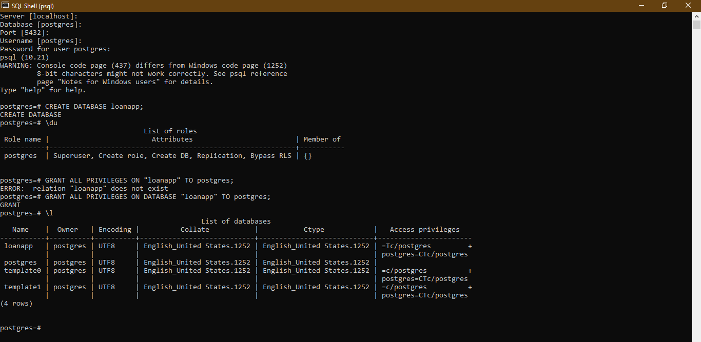
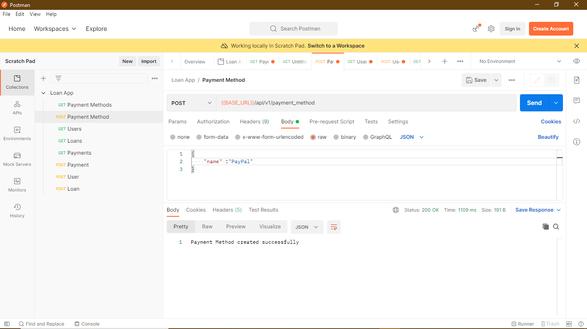
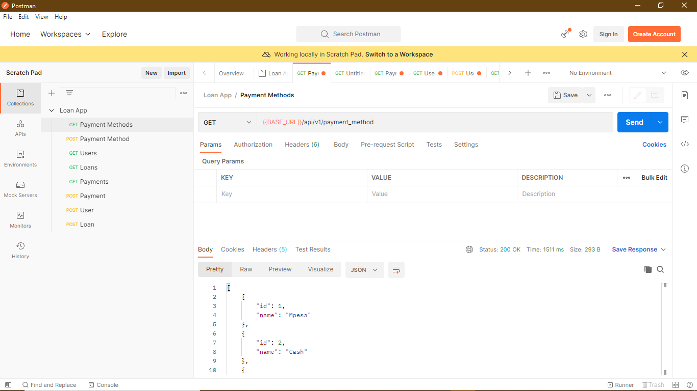

Create an application, in java spring boot, that connects to a postgresql database and exposes
RESTful APIs that perform the following:
1. Create user
2. Search for user
3. Create user loan
4. Search for loan
5. Make payments to loan, adjust loan balance
6. Search for payment

## Connect to PostGre SQL

## Get All User Accounts

## Create Payment Method
_

## Get All Payment Method
_

